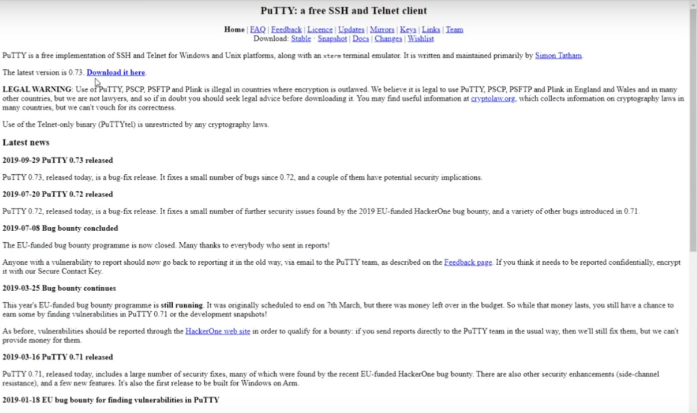
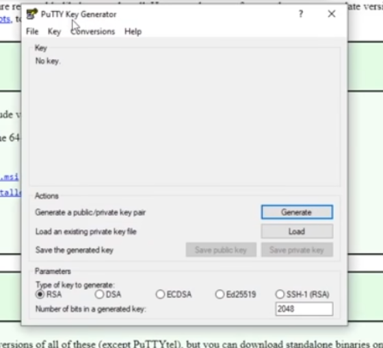
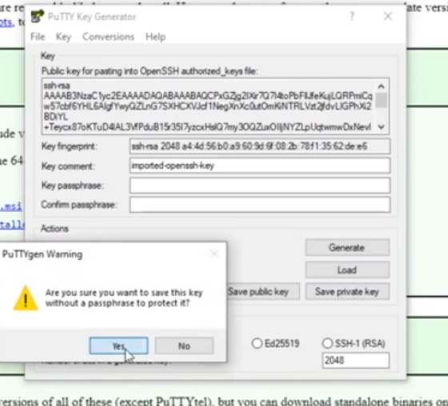
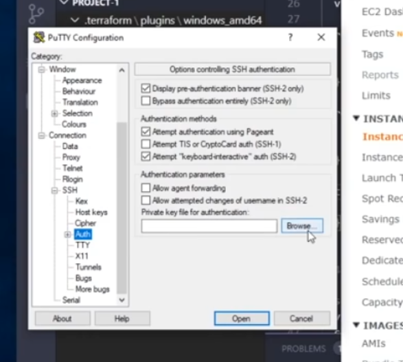
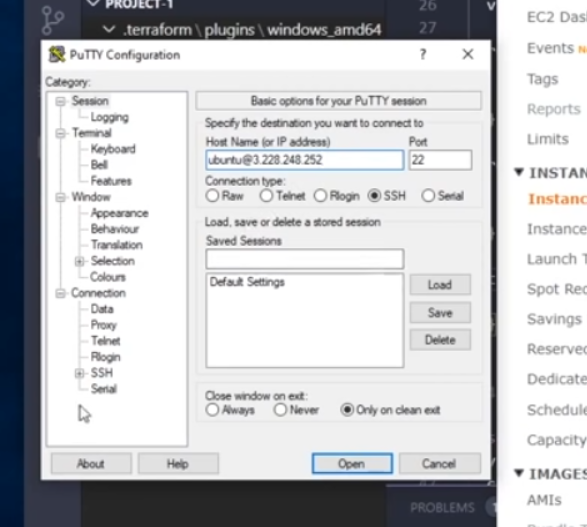
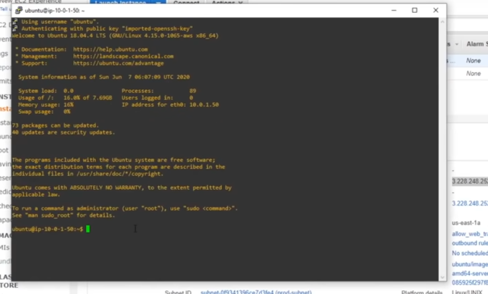

# Tugas Oprec Lab AJK 2 - Deploy LEMP Stack dengan Terraform dan AWS

### Anggota Kelompok:

- Alfadito Aulia Denova (5025211157)
- Mohammad Kamal (5025211180)
- Yehezkiel Wiradhika (5025201086)

### Soal

1. Membuat instance/server dan resource lainnya (apabila dibutuhkan) pada cloud provider menggunakan Terraform.

2. Pastikan telah mengkonfigurasi firewall dengan membuka akses pada port 22, 80, dan 443.

3. Deploy aplikasi Laravel dengan NGINX pada instance/server yang telah dibuat (berikut source code nya: https://gitlab.com/kuuhaku86/web-penugasan-individu.git)

4. Deploy database menggunakan MySQL untuk menyimpan data dari aplikasi Laravel. Ubah username dan password sesuai dengan urutan kelompok kalian. Contoh kelompok1

5. Menambahkan DNS pada aplikasi Laravel yang telah ter-deploy.

6. Menambahkan konfigurasi SSL menggunakan certbot pada DNS aplikasi Laravel yang telah ter-deploy.

7. Backup Log: melakukan otomasi backup access log pada NGINX setiap 1 jam dan menguploadnya ke Google Drive dan di folder masing masing kelompok.

### Referensi

- https://youtu.be/SLB_c_ayRMo
- https://www.digitalocean.com/community/tutorials/how-to-install-and-configure-laravel-with-nginx-on-ubuntu-20-04
- https://www.clickittech.com/tutorial/deploy-laravel-on-aws-ec2/
- https://techvblogs.com/blog/deploy-laravel-project-nginx-ubuntu

## Penjelasan code

Program ini melakukan provisioning pada Amazon Web Service (AWS) infrastruktur menggunakan Terraform.

Dimulai dengan menetapkan region server. Guna kode ini adalah untuk menetapkan dimana server akan dihost.

    provider "aws" {
    region = "us-east-1"
    access_key = ""
    secret_key = ""
    }

Dalam kode ini `"aws"` adalah nama dari provider, sementara itu curly brackets adalah pembatas setiap fungsi.
` acces_key` dan `secret_key` dimasukan melalui CLI AWS. Agar tidak terjadi kebocoran credentials.

Lalu code:

    resource "aws_vpc" "prod-vpc" {
    cidr_block = "10.0.0.0/16"
    tags = {
    Name = "production"
    	}
    }

membuat Virtual Private Cloud (VPC) dengan CIDR block 10.0.0.0/16 dan diberi nama production. `aws_vpc` adalah resource yang ingin diconfigurasi, `prod-vpc` adalah nama untuk calling pada program sementara `tags` adalah nama yang muncul pada dashboard AWS. Cara penamaan ini akan applied pada fungsi lainnya. `cidr_block` ditetapkan dengan nilai `10.0.0.0/16`.

Untuk membuat gateway internet, digunakan code berikut :

    resource "aws_internet_gateway" "gw" {
    vpc_id = aws_vpc.prod-vpc.id
    }

Gunanya adalah untuk membuat internet gateway. Cara calling di code ini dengan menuliskan nama untuk calling pada program seperti `aws_vpc.prod-vpc.id`.

Langkah selanjutnya adalah membuat route table. Ini bisa dilakukan dengan menggunakan code:

    resource "aws_route_table" "prod-route-table" {
    vpc_id = aws_vpc.prod-vpc.id

    route {
    cidr_block = "0.0.0.0/0"
    gateway_id = aws_internet_gateway.gw.id
    }

    route {
    ipv6_cidr_block = "::/0"
    gateway_id = aws_internet_gateway.gw.id

    }

    tags = {
    Name = "Prod"
    }

    }

Setelah membuat route table, buat subnet menggunakan code berikut :

    resource "aws_subnet" "subnet-1" {
    vpc_id = aws_vpc.prod-vpc.id
    cidr_block = "10.0.1.0/24"
    availability_zone = "us-east-1a"

    tags = {

    Name = "prod-subnet"

    	}

    }

Hubungan subnet dengan route table menggunakan code :

    resource "aws_route_table_association" "a" {
    subnet_id = aws_subnet.subnet-1.id
    route_table_id = aws_route_table.prod-route-table.id
    }

Firewall digunakan menggunakan code :

    resource "aws_security_group" "allow_web" {
    name = "allow_web_traffic"
    description = "Allow Web inbound traffic"
    vpc_id = aws_vpc.prod-vpc.id

    ingress {
    description = "HTTPS"
    from_port = 443
    to_port = 443
    protocol = "tcp"
    cidr_blocks = ["0.0.0.0/0"]
    }

    ingress {
    description = "HTTP"
    from_port = 80
    to_port = 80
    protocol = "tcp"
    cidr_blocks = ["0.0.0.0/0"]
    }

    ingress {
    description = "SSH"
    from_port = 22
    to_port = 22
    protocol = "tcp"
    cidr_blocks = ["0.0.0.0/0"]
    }

    egress {
    from_port = 0
    to_port = 0
    protocol = "-1"
    cidr_blocks = ["0.0.0.0/0"]
    }

    tags = {
    Name = "allow_web"
    	}

    }

Fungsi dari wirewall ini adalah untuk mengfilter port apa saja yang bisa dilewati. Disini port yang bisa dilewati adalah port 80, 22, dan 443. Yang secara berurutan adalah port HTTP, SSH, dan HTTPS.

Langkah selanjutnya adalah buat network interface menggunakan code :

    resource "aws_network_interface" "web-server-nic" {
    subnet_id = aws_subnet.subnet-1.id
    private_ips = ["10.0.1.50"]
    security_groups = [aws_security_group.allow_web.id]
    }

Lalu untuk membuat elastic IP, gunakan code :

    resource "aws_eip" "one" {
    vpc = true
    network_interface = aws_network_interface.web-server-nic.id
    associate_with_private_ip = "10.0.1.50"
    depends_on = [aws_internet_gateway.gw]
    }

Dan code

    output "server_public_ip" {
    value = aws_eip.one.public_ip
    }

Digunakan untuk output public IP dari server.

Dan langkah selanjutnya adalah membuat server ubuntu dan install tools untuk LEMP stack yang dibutuhkan untuk deploy laravel. Dapat diimplementasikan dengan code berikut :

    resource "aws_instance" "web-server-instance" {
    	ami = "ami-0557a15b87f6559cf"
    	instance_type = "t2.micro"
    	availability_zone = "us-east-1a"
    	key_name = ""
    	network_interface {
    	device_index = 0
    	network_interface_id = aws_network_interface.web-server-nic.id
    	}
    				user_data = <<-EOF
    				sudo add-apt-repository ppa:ondrej/php
    				sudo apt-get install -y php7.4-{cli,fpm,mbstring,mysql,curl,mcrypt,xml}
    				sudo apt-get install -y mysql-server
    				sudo apt install -y nginx
    				sudo apt-get install -y git
    				sudo apt-get install -y zip unzip
    				php -r "copy('https://getcomposer.org/installer', 'composer-setup.php');"
    				php -r "if (hash_file('sha384', 'composer-setup.php') === '55ce33d7678c5a611085589f1f3ddf8b3c52d662cd01d4ba75c0ee0459970c2200a51f492d557530c71c15d8dba01eae') { echo 'Installer verified'; } else { echo 'Installer corrupt'; unlink('composer-setup.php'); } echo PHP_EOL;"
    				php composer-setup.php
    				php -r "unlink('composer-setup.php');"
    				sudo mv composer.phar /usr/local/bin/composer
    				EOF
    tags = {
    Name = "linux-ubuntu"
    	}
    }

code yang ditulis dibawah `user_data = <<-EOF` adalah command terminal yang biasa dimasukan untuk melakukan instalasi tools yang diperlukan dan kebuuthan lainnya. Lalu diakhiri dengan EOF sebagai batas.

## SSH/Telnet untuk mengakses ubuntu AWS

setelah kita menginstall semua tools yang ada kita pertama masuk ke dalam cli mode dari server dengan menggunakan ssh/telnet.

hal pertama yang kita lakukan mendownload menggunakan aplikasi windows bernama PuTTY.



setelah itu kita membuat puttygen (untuk load key yang telah kita buat sebelumnya)



lalu save setelah kita load key yang telah dibuat (save ini bertujuan agar putty dapat masuk ke dalam ubuntu aws)



setelah itu kita membuka key yang telah kita generate dari puttygen pada aplikasi putty



setelah itu kita buka ssh/telnet dari os aws yang telah kita buat sehingga kita bisa mengakses CLInya



ubuntu sudah dapat diakses



## Clone dan Setup Laravel

karena semua tools yang kita butuhkan untuk mendeploy aplikasi laravel dengan nginx telah diinstall sekarang kita tinggal melakukan instalasi aplikasi itu sendiri.

pertama, pastikan dulu kalau mysql dan nginx telah berjalan (akan lebih mudah jika kita merupakan super user)

jadilah super user

```
sudo su
```

check apakah mysql dan nginx telah berjalan

```
systemctl status mysql
systemctl status nginx
```

apabila mysql atau nginx masih belum berjalan, kita jalankan script berikut

```
systemctl start mysql
systemctl enable mysql
systemctl start nginx
systemctl enable nginx
```

hal pertama yang kita lakukan adalah clone aplikasi yang telah disediakan.

```
git clone https://gitlab.com/kuuhaku86/web-penugasan-individu
```

setelah itu kita akan mengganti nama folder aplikasi tersebut menjadi "laravel" sehingga lebih mudah

```
mv web-penugasan-individu laravel
```

setelah itu masuk ke dalam aplikasi tersebut

```
cd laravel
```

kita install dan melakukan migrasi database

```
composer install
cp .env.example .env
php artisan key:generate
php artisan migrate
```

## Konfigurasi Laravel

untuk melakukan konfigurasi laravel, pada main dir laravel, kita lakukan

```
nano .env
```

berikut merupakan konfigurasinya

```
APP_NAME=Laravel
APP_ENV=development
APP_KEY=APPLICATION_UNIQUE_KEY_DONT_COPY
APP_DEBUG=true
APP_URL=http://localhost

LOG_CHANNEL=stack

DB_CONNECTION=mysql
DB_HOST=127.0.0.1
DB_PORT=3306
DB_DATABASE=laravel
DB_USERNAME=kelompok7
DB_PASSWORD=kelompok7
```

setelah itu "ctrl+x" lalu tekan "y"

karena kita belum memiliki user bernama "kelompok7" kita sekarang membuat user tersebut

buka mysql lalu login dengan menggunakan root user (yang bisa membuat user baru)

```
mysql -u root -p
```

buat user baru

```
CREATE USER 'kelompok7'@'localhost' IDENTIFIED BY 'kelompok7';
```

beri user permission pada kelompok7 terhadap database laravel

```
GRANT ALL PRIVILEGES ON laravel.* TO 'kelompok7'@'localhost'
```

lalu lakukan flushing untuk reload tabel grant untuk memastikan bahwa privilege yang telah diberikan memberi efek

```
FLUSH PRIVILEGES;
```

keluar dari mysql

```
exit
```
